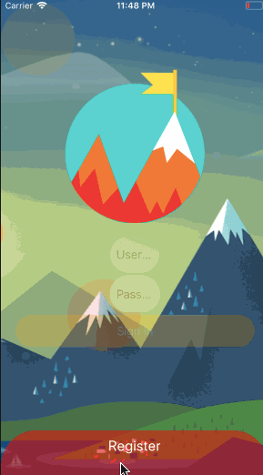

# AwesomeAnimation/ParallaxLogin

Simple butter-smooth animations created using **_React-Native_** for demonstrating the capabilities of the **_Animated API_** of react native.
It is bootstrapped with [Create React Native App](https://github.com/react-community/create-react-native-app).

## Preview

## Preivew on Expo

# Scan with Expo

Scanning this QR code with your Expo mobile app loads this experience immediately.

OR

# Type the Address

Typing 
>exp://exp.host/@shubham56/awesomeanimation
inside of Expo will also open this experience.

# Need Expo?

With Expo you can build, share and enjoy many mobile experiences. Download the app to try AwesomeAnimation today.
For links to install the Expo app, please visit https://expo.io.

## Dependencies

 * React Native
 * React Navigation
 * NativeBase
 * Expo

## Getting Started

**1. Clone the Repo**
On the command prompt/shell run the following commands

>$ git clone https://github.com/shubham56/AwesomeAnimation.git

>$ cd AwesomeAnimation

>$ npm install

**2. To start the expo app**

Run the following command

>$ npm start

**To run on iOS simulator/device**

Run the following command

>$ npm run ios

**To run on android emulator/device**

Run the following command

>$ npm run android

## Credits

[NativeBase](https://nativebase.io/)

[ReactNative](https://facebook.github.io/react-native/)

[Expo](https://expo.io)

[ReactNavigation](https://reactnavigation.org/)
