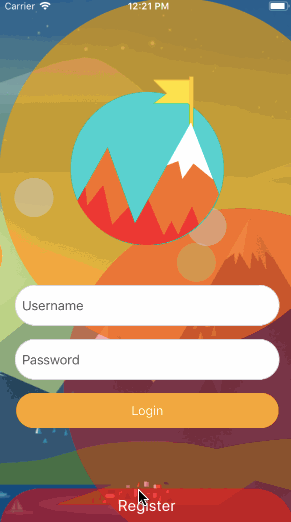
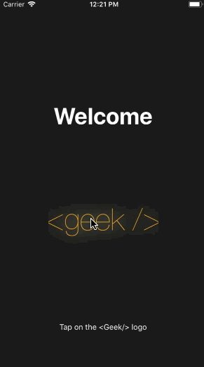

# AwesomeAnimation/ParallaxLogin

Simple butter-smooth animations created using **_React-Native_** for demonstrating the capabilities of the **_Animated API_** of react native.
It is bootstrapped with [Create React Native App](https://github.com/react-community/create-react-native-app).

## Demo

# #1 Page Switch Animation

# #2 SubmitButton Animation

# #3 Shattering Image Animation

## Demo on Expo

# Scan with Expo

Scanning this QR code with your Expo mobile app loads this experience immediately.

OR

# Type the Address

Typing 

>exp://exp.host/@shubham56/awesomeanimation

inside of Expo will also open this experience.

# Need Expo?

With Expo you can build, share and enjoy many mobile experiences. Download the app to try AwesomeAnimation today.
For links to install the Expo app, please visit https://expo.io.

## Dependencies

 * React Native
 * React Navigation
 * NativeBase
 * Expo

## Getting Started 

**1. Clone the Repo**
On the command prompt/shell run the following commands

>$ git clone https://github.com/shubham56/TripleAnimationDemo.git

>$ cd TripleAnimationDemo

>$ npm install

**2. To start the demo on expo app**

Run the following command

>$ npm start

**To run on iOS simulator/device**

Run the following command

>$ npm run ios

**To run on android emulator/device**

Run the following command

>$ npm run android

**3. How to use**

# #1 Page Switch Animation

>import PageSwitchBackGroundAnims from "./Animations3T/main/PageSwitchBackGroundAnims";

**PROPS**
| Name               | Type            | Default                                                            | Note                             |
|--------------------|-----------------|--------------------------------------------------------------------|----------------------------------|
| containerStyle     | style object    | null                                                               | none                             |
| backgroundImage    | uri             | null                                                               | none                             |
| logo               | uri             | null                                                               | none                             |
| logoStyle          | style object    | null                                                               | none                             |
| lgDecorColorArray  | Array<Array(2)> | [["rgba(255,165,0,1)", "rgba(50,205,50,1)"],"#ff0000", "#7d18f2"]] | refer note                       |
| switchButtonColor1 | color(string)   | "rgba(255,0,0,0.5)"                                                | none                             |
| switchButtonColor2 | color(string)   | "rgba(125, 24, 242, 0.5)"                                          | none                             |
| smDecorColor       | color(string)   | "rgba(200, 200, 200, 0.5)"                                         | none                             |
| dimensionsSmDecor  | Integer         | 50                                                                 | none                             |
| dimensionsLgDecor  | Integer         | 450                                                                | none                             |
| noOfDecors         | Integer         | 6                                                                  | none                             |
| page1SwitchText    | string          | "page2"                                                            | Text on switch button for page 2 |
| page2SwitchText    | string          | "page1"                                                            | Text on switch button for page 1 |
| page1              | React Component | null                                                               | Content Page1                    |
| page2              | React Component | null                                                               | Content Page2                    |

> note: Array of size 2 where in each 0th index is the color of corresponding Large Decor on 1st page and 1th index is the color of corresponding Large Decor on 2st page

# #2 SubmitButton Animation

>import SubmitButtonWithAnimation from "./Animations3T/main/SubmitButtonWithAnimation";

# #3 Shattering Image Animation

>import ShatteringImage from "./Animations3T/main/ShattereringImage";

## Credits

[NativeBase](https://nativebase.io/)

[ReactNative](https://facebook.github.io/react-native/)

[Expo](https://expo.io)

[ReactNavigation](https://reactnavigation.org/)
